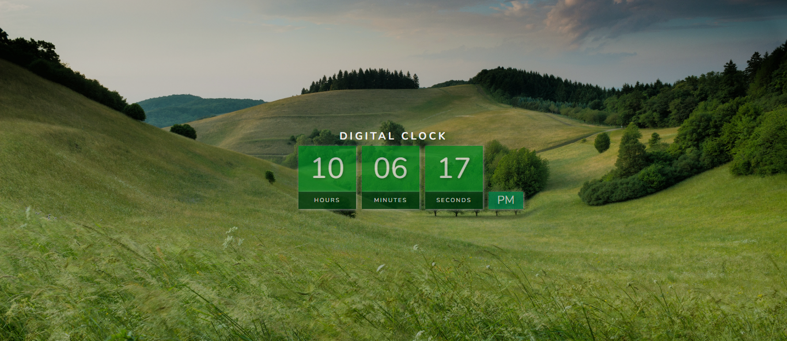

# Digital Clock Project



A simple and stylish digital clock project built using HTML, CSS, and JavaScript. This project is part of the #30Days30Projects coding challenge.

## Features

- Real-time updating digital clock.
- 12-hour format with AM/PM indication.
- Stylish gradient background with nature-themed aesthetics.

## Live Demo

Check out the live demo [here](https://astonishing-pika-7e2f81.netlify.app).

## Screenshots


## How to Use

1. Clone the repository:

   ```bash
   git clone https://github.com/SiddharthaSarkar1/30-days-30-projects

2. Open index.html in your browser.

3. Marvel at the live digital clock!

## Contributing

Contributions are welcome! Feel free to open issues and submit pull requests.

Happy Coding! 🚀✨
