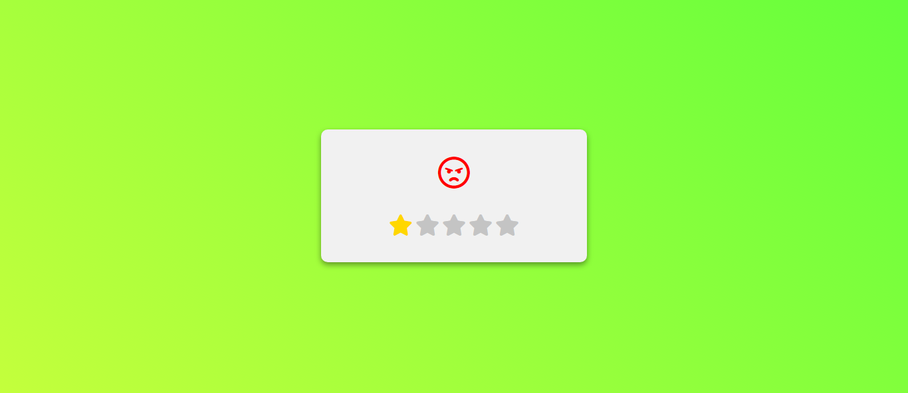
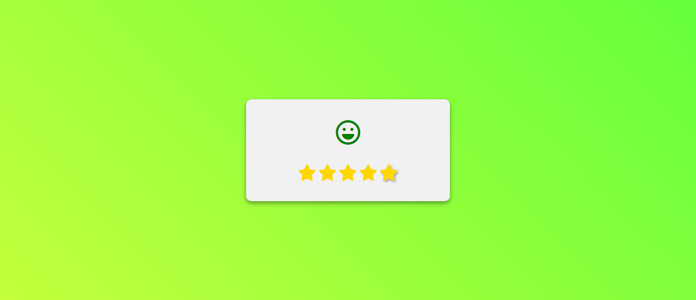

# Emoji Rating Project



A simple Emoji Rating project where users can express their feedback using emojis and stars. This project is part of the #30Days30Projects coding challenge.

## Features

- Five emojis representing different feedback levels.
- Five-star rating system for additional feedback.
- Clean and responsive design.

## Live Demo

Check out the live demo [here](https://659322eb73b216ff46441bcd--mellow-puffpuff-59947f.netlify.app).

## Screenshots



## How to Use

1. Clone the repository:

   ```bash
   git clone https://github.com/SiddharthaSarkar1/30-days-30-projects

2. Open index.html in your browser.

3. Share your feedback with emojis and stars!

 ## Custom Styling
Feel free to customize the styling by adjusting the CSS code in the styles.css file.

 ## JavaScript Functionality
The JavaScript code in script.js handles the dynamic rating update and emoji animation based on user clicks.

 ## Contributing
Contributions are welcome! Feel free to open issues and submit pull requests.

Happy Emoji Rating! 🌟😊