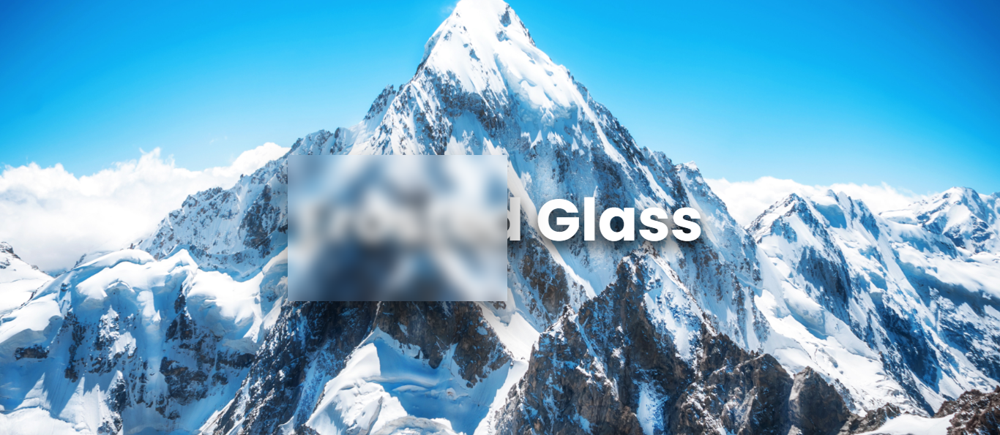
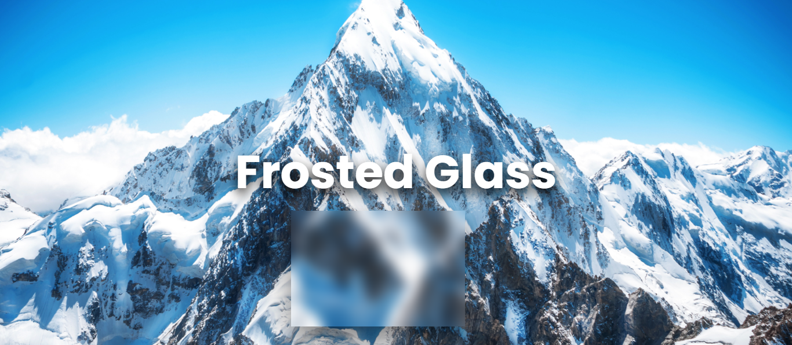

# Frosted Glass Effect Project



Create a mesmerizing Frosted Glass Effect with this simple and stylish web project. Part of the #30Days30Projects coding challenge.

## Features

- **Dynamic Glass Movement:** The frosted glass element follows the mouse cursor, creating an interactive and engaging user experience.
  
- **Blurred Background:** The background image is blurred using the backdrop-filter property, enhancing the frosted glass effect.

## Screenshots



## How to Use

1. **Clone the Repository:**
   ```bash
   git clone https://github.com/SiddharthaSarkar1/30-days-30-projects

2. Open index.html in your browser.

3. Explore the mesmerizing frosted glass effect with the dynamic glass movement.

## Customization:
Feel free to experiment with different background images or tweak the styling in style.css to match your preferences.

## JavaScript Functionality
The JavaScript code in script.js ensures that the frosted glass element dynamically follows the mouse cursor, adding a touch of interactivity.# Frosted Glass Effect Project


Create a mesmerizing Frosted Glass Effect with this simple and stylish web project. Part of the #30Days30Projects coding challenge.

## Features

- **Dynamic Glass Movement:** The frosted glass element follows the mouse cursor, creating an interactive and engaging user experience.
  
- **Blurred Background:** The background image is blurred using the backdrop-filter property, enhancing the frosted glass effect.

## Screenshots


## How to Use

1. **Clone the Repository:**
   ```bash
   git clone https://github.com/SiddharthaSarkar1/30-days-30-projects

2. Open index.html in your browser.

3. Explore the mesmerizing frosted glass effect with the dynamic glass movement.

## Customization:
Feel free to experiment with different background images or tweak the styling in style.css to match your preferences.

## JavaScript Functionality
The JavaScript code in script.js ensures that the frosted glass element dynamically follows the mouse cursor, adding a touch of interactivity.