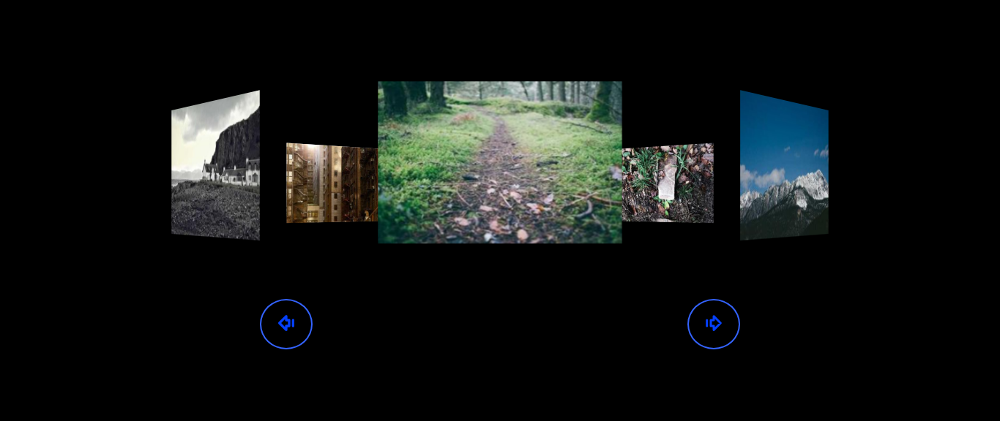
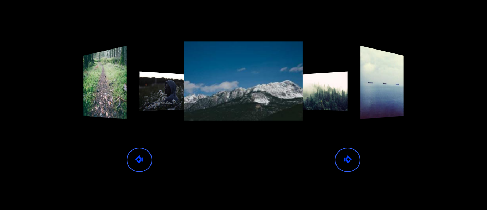
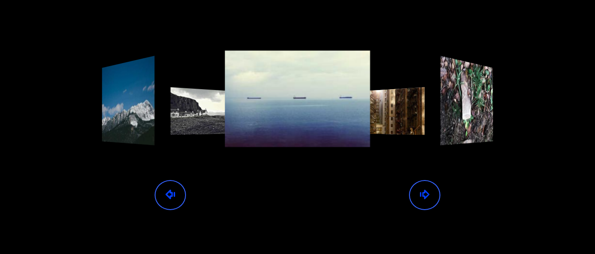
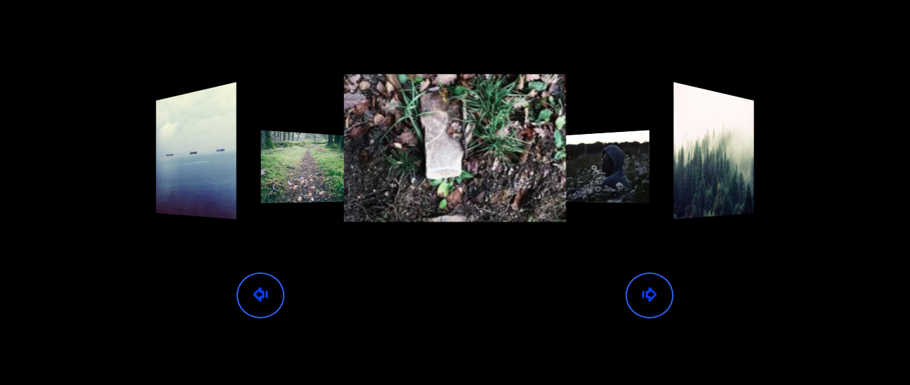

# Image Gallery 🌟

Dive into the visual delight of my Day 5 project - the Rotating Image Gallery!

## Features
- **Dynamic 3D Rotation:** Experience captivating 3D rotation effects.
- **Seamless Navigation:** Navigate through the gallery effortlessly using buttons.
- **Responsive Design:** Enjoy the gallery on any screen size.

## Usage
1. Open `index.html` in your browser.
2. Navigate using the previous (`#prev`) and next (`#next`) buttons.
3. Experience the captivating journey through images!

## Technologies
- HTML
- CSS
- JavaScript

## Demo
Check out the live demo [here](https://siddharthasid.github.io/image-gallery/) and explore the rotating magic!

## Screenshots

## Acknowledgments
- Special thanks to [Lorem Picsum](https://picsum.photos/) for stunning images.

Enjoy the visual feast! 🌈🖼️✨
