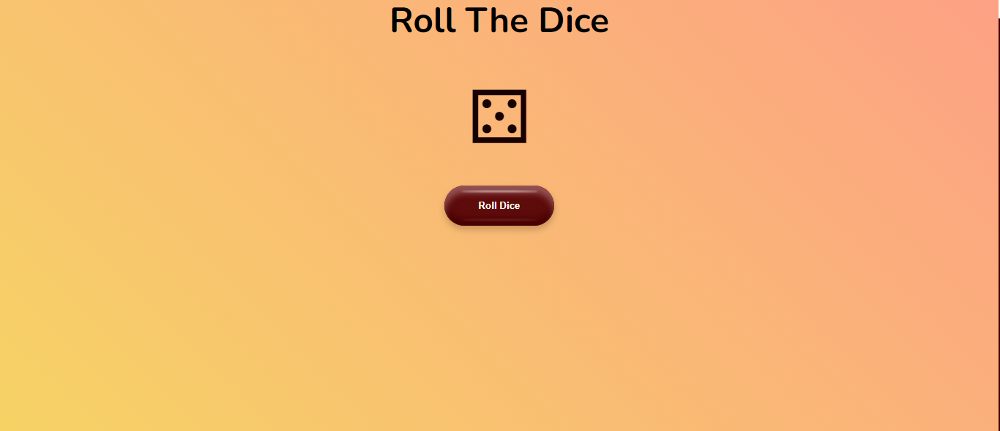
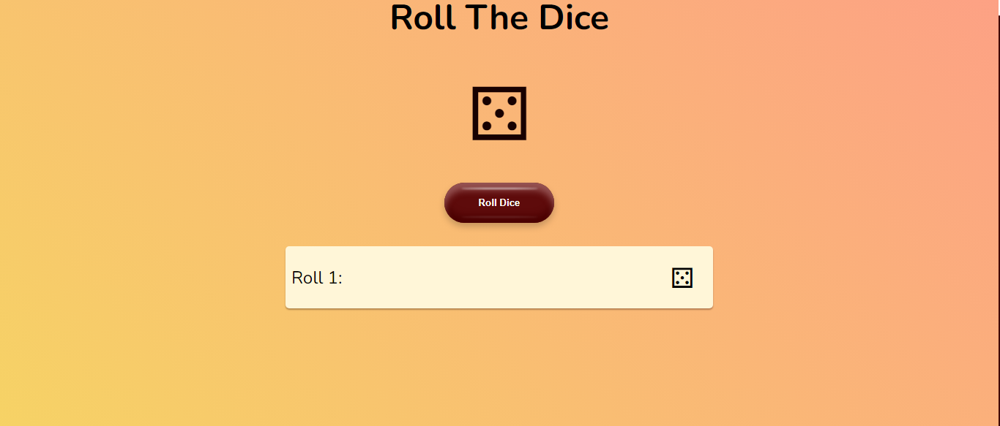
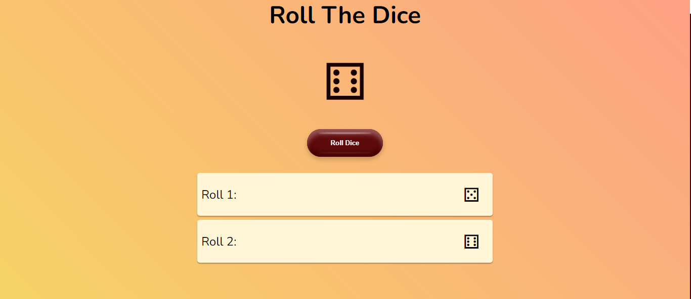
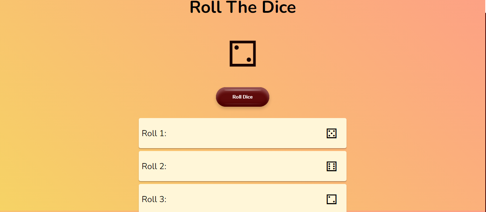

# Roll The Dice

Welcome to "Roll The Dice" – a delightful dice rolling simulation app. Experience the thrill of each roll with beautifully animated dice faces.

## Features
- **Dynamic Animation:** Watch the dice roll with a captivating 3D animation.
- **Roll History:** Keep track of your rolls with a history section.
- **Stylish UI:** A stylish user interface for an enjoyable experience.

## How to Play
1. Click the "Roll Dice" button.
2. Witness the animated dice roll.
3. Check your roll history for each toss.

Feel the excitement with every click! 🎲✨

## Project Preview

## Demo
Check out the live demo [here](https://siddharthasid.github.io/roll-the-dice/).

## Roll History
- Roll 1: 🎲
- Roll 2: 🎲🎲
- Roll 3: 🎲🎲🎲
- ...

## Technologies Used
- HTML5
- CSS3
- JavaScript

## How to Run Locally
1. Clone the repository.
2. Open `index.html` in your preferred browser.

Feel the luck with each roll! 🍀🎲
