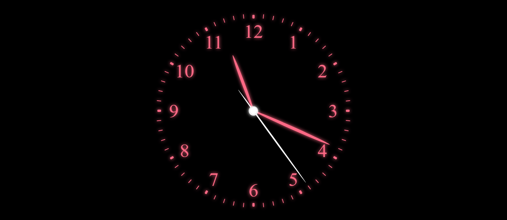
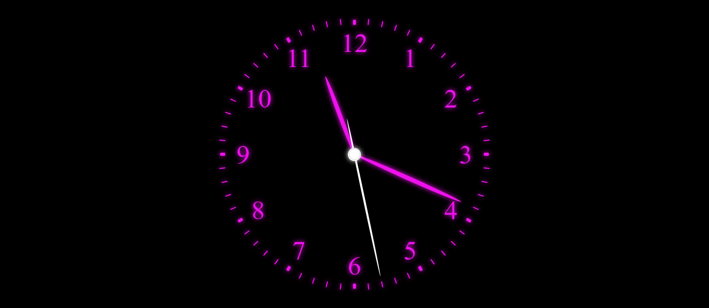
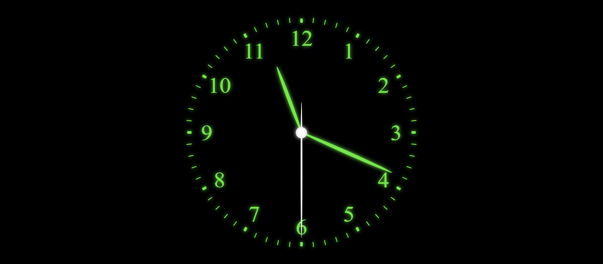
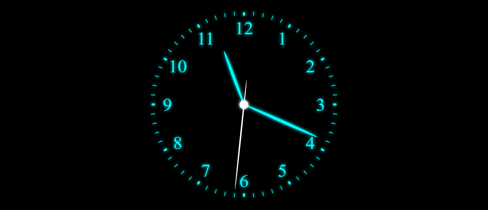

# Clock Project

This project is a stylish clock created using HTML, CSS, and JavaScript. It features animated clock hands, neon colors, and dynamic background changes.

## Table of Contents

- [Project Preview](#project-preview)
- [Demo](#demo)
- [Project Structure](#project-structure)
- [Usage](#usage)
- [Color Changing](#color-changing)

## Project Preview

## Demo
Check out the live demo [here](https://siddharthasid.github.io/analog-clock/).

## Project Structure

The project is organized into three main files:

- **index.html:** The HTML file containing the structure of the clock.
- **style.css:** The CSS file responsible for styling the clock and its elements.
- **script.js:** The JavaScript file providing clock functionality and color-changing logic.

## Usage

Simply open the `index.html` file in a web browser to view the clock. The clock displays the current time with animated clock hands and a dynamic background.

## Color Changing

The clock elements change color every second, creating a vibrant and visually appealing experience. The color palette consists of 100 unique neon colors.

