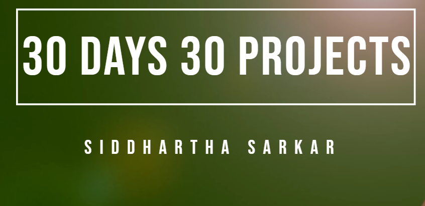

# 30 Days, 30 Projects Challenge

Welcome to my 30 Days, 30 Projects coding challenge repository! This is where I'll be documenting my journey as I take on the challenge of building and completing 30 coding projects in 30 days.

## Table of Contents

- [About the Challenge](#about-the-challenge)
- [Projects](#projects)
- [How to Use](#how-to-use)
- [Contributing](#contributing)

## About the Challenge

For the next 30 days, I'll be pushing my coding skills by building a new project each day. This challenge is not just about coding but also about learning, creativity, and pushing my boundaries as a developer.

## Projects

- [Day - 1 (Digital Clock)](./Day-1)
  - [Live Demo](https://astonishing-pika-7e2f81.netlify.app)
  - [Code](./Day-1)

- [Day - 2 (Emoji Rating)](./Day-2)
  - [Live Demo](https://659322eb73b216ff46441bcd--mellow-puffpuff-59947f.netlify.app)
  - [Code](./Day-2)

- [Day - 3 (Frosted Glass Effect)](./Day-3)
  - [Live Demo](https://siddharthasid.github.io/frosted-glass-effect/)
  - [Code](./Day-3)

- [Day - 4 (Lets Multiply)](./Day-4)
  - [Live Demo](https://siddharthasid.github.io/lets-multiply/)
  - [Code](./Day-4)

- [Day - 5 (Image Gallery)](./Day-5)
  - [Live Demo](https://siddharthasid.github.io/image-gallery/)
  - [Code](./Day-5)

- [Day - 6 (Roll The Dice)](./Day-6)
  - [Live Demo](https://siddharthasid.github.io/roll-the-dice/)
  - [Code](./Day-6)

- [Day - 7 (Clock)](./Day-7)
  - [Live Demo](https://siddharthasid.github.io/analog-clock/)
  - [Code](./Day-7)

- [Day -  (Stylish Calendar)](./Day-8)
  - [Live Demo](https://siddharthasid.github.io/stylish-calendar/)
  - [Code](./Day-8)

## How to Use

Each project has its own directory with a README.md file providing details on how to use and run the project.

## Contributing

Contributions are welcome! If you have ideas, improvements, or want to fix a bug, feel free to open an issue or submit a pull request.

Happy Coding! 🚀✨
